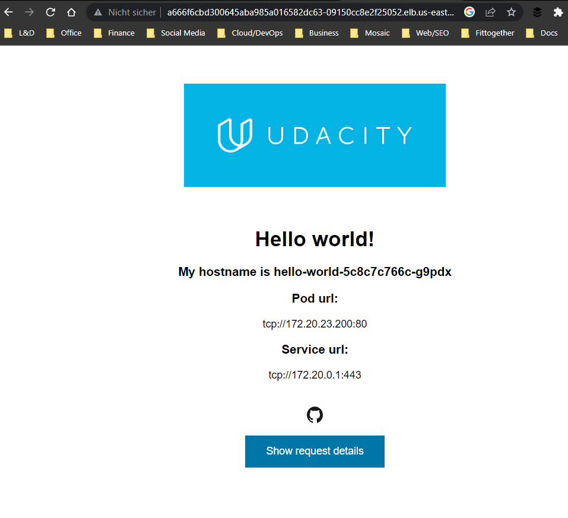

# Deployment Roulette

Reviewer Feedback 

Deployment Troubleshooting
- hello_world_troubleshooting.png shows the faulty code segment
- hello_World_healthy_logs.png shows that the application is returning the logs healthy! as expected.

Node Elasticity
Thanks for the hint, but I do not use the Udacity credentials, instead use my personal.
Any other ideas?
Since the auto-scaler is not ready yet, I increased the pods semi-automated via terraform.
Please find the screenshot of all working nodes under bloaty_pods_increased.png

Observability

Diagramming

## Getting Started

### Dependencies

- AWS Account
- [kubectl](https://kubernetes.io/docs/tasks/tools/)
- [awscli](https://aws.amazon.com/cli/)
- [eksctl](https://eksctl.io/introduction/#installation)
- [terraform](https://learn.hashicorp.com/tutorials/terraform/install-cli?in=terraform/aws-get-started)
- [helm](https://www.eksworkshop.com/beginner/060_helm/helm_intro/install/)

### Installation 
**Step by step explanation of how to get a dev environment running.**

The AWS environment will be built in the `us-east-2` region of AWS

1. Set up your AWS credentials from Udacity AWS Gateway locally
    - `https://docs.aws.amazon.com/cli/latest/userguide/cli-configure-files.html`

2. From the AWS console manually create an S3 bucket in `us-east-2` called `udacity-tf-<your_name>`
   e.g `udacity-tf-treboder`
    - The click `create bucket`
    - Update `_config.tf` with your S3 bucket name

3. Deploy Terraform infrastructure
    - `cd starter/infra`
    - `terraform init`
    - `terraform apply`

5. Setup Kubernetes config so you can ping the EKS cluster
    - `aws eks --region us-east-2 update-kubeconfig --name udacity-cluster`
    - Change Kubernetes context to the new AWS cluster
        - `kubectl config use-context <cluster_name>`
            - e.g ` arn:aws:eks:us-east-2:139802095464:cluster/udacity-cluster`
    - Confirm with: `kubectl get pods --all-namespaces`
    - Change context to `udacity` namespace
        - `kubectl config set-context --current --namespace=udacity`

6. Run K8s initialization script
    - `./initialize_k8s.sh`

7. Clean up the environment with the `nuke_everything.sh` script or run the steps individually
```
terraform state rm kubernetes_namespace.udacity && terraform state rm kubernetes_service.blue
kubectl delete all --all -n udacity
terraform destroy
```

## Applications

### 1. Hello World Deployment
1. Check all running pods with `kubectl get pods` and grab the `<hello-world-pod-name>`
2. Get the details for the pod with `kubectl describe pod <hello-world-pod-name>` and check the status
3. Go to AWS and get the load balancer DNS name, which points to the two EC2 instances serving the hello-world app
4. Check that the hello-world application is returning the logs healthy! by `running kubectl logs <pod_name>`
5. Check the hello-world app with your browser and see 


### 2. Canary Deployment
1. Ensure you have connectivity to your local kubernetes cluster 
2. `kubectl config use-context docker-desktop`
3. Optional: Permanently switch namespace with `kubectl config set-context --current --namespace=udacity` and you do not need `-n udacity` at the end of every command
4. Apply the `index_v1_html.yml` & `index_v2_html.yml` configmaps to deploy the service html templates.
    1. Run `kubectl apply -f index_v1_html.yml`
    2. Run`kubectl apply -f index_v2_html.yml`
    3. Check with `kubectl get configmap -n udacity`
5. Deploy the service to the cluster (`canary-svc.yml`)
    1. Run `kubectl apply -f .\canary-svc.yml`
    2. Check with `kubectl get service -n udacity`
6. Deploy the v1 & v2 starter template to the cluster (`canary-v1.yml`, `canary-v2.yml`)
    1. Run `kubectl apply -f .\canary-v1.yml` (container with v1 started right now)
    2. Run `kubectl apply -f .\canary-v2.yml` (You'll notice v2 has `0` replicas)
7. Get the service cluster ip address and curl it 5 times to confirm only v1 of the application is reachable
    1. `kubectl get service canary-svc -n udacity`
    2. Use an ephermeral container to access the kubernetes internal network
        1. `kubectl run debug --rm -i --tty --image nicolaka/netshoot -- /bin/bash`
        2. `curl <service_ip>` and see `<html><h1>This is version 1</h1></html`
8. Now we will initiate a canary deployment for `canary-v2` via a bash script
    1. Run the bash script `./canary.sh`
    2. Check that the procedure replaced all the containers with the new nginx version
9. During the first manual verification step ensure you can curl the service and get a response from both versions of the application.
    1. Then continue until all replicas of v2 are deployed
10. Tear down environment
     1. `kubectl delete all --all -n udacity`

### 3. Blue-Green Deployment
1. Log into your student AWS account and switch to region `us-east-2`
2. Setup your local aws credentials
3. Launch the kubernetes cluster in starter terraform code provided
    1. `terraform init`
    2. `terraform plan`
    3. `terraform apply` optionally with parameter `--auto-approve`
4. Ensure you have connectivity to your aws kubernetes cluster
   1.`aws eks --region us-east-2 update-kubeconfig --name udacity-cluster`
   2.Change Kubernetes context to the new AWS cluster
    - `kubectl config use-context arn:aws:eks:us-east-2:225791329475:cluster/udacity-cluster`
    3. Confirm with: `kubectl get pods --all-namespaces`
    4. Change context to `udacity` namespace
        - `kubectl config set-context --current --namespace=udacity`
5. Apply the `index_blue_html.yml` & `index_green_html.yml` configmaps to deploy the service html templates.
    1. Run `kubectl apply -f .\index_blue_html.yml`
    2. Run `kubectl apply -f .\index_green_html.yml`
    3. Check with `kubectl get configmap`
6. Deploy the blue application to the cluster `blue.yml`
    1. Run `kubectl apply -f .\blue.yml` spawns the pods with app "blue"
    2. Check with `kubectl get pods` shows the running pods with app "blue"
7. Check the "blue" deployment via curl
    1. Get the external ip from the "blue" load balancer with `kubectl get svc`
    2. Run `curl <external_ip_of_loadbalancer>` to see `<html><h1>This is version BLUE</h1></html>`
    3. Or simply start your browser of choice: `<external_ip_of_loadbalancer>`
8. You'll notice there is a load balancer service created for you in the `kubernetes_resources.tf`
    1. There is also an associated dns zone `udacityexercise` in `dns.tf` that allows you to curl the hostname `blue-green.udacityexercise` from an ec2 instance
    2. Confirm you can curl this hostname from the created `curl-instance` ec2 instance (also created via terraform before)
        1. Connect to the ec2 instance via EC2 Instance Connect
        2. Then `curl blue-green.udacityproject`
9. Deploy the "green" app by executing the shell script `blue-green.sh`, which effectively:
````
    kubectl apply -f ./index_green_html.yml
    kubectl apply -f ./green.yml
````
10. Confirm that the "green" app is deployed
    1. Run `kubectl get pods` to see the green pods running
    2. Get the external ip from the "green" load balancer with `kubectl get svc`
    3. Run `curl <external_ip_of_loadbalancer>` to see `<html><h1>This is version GREEN</h1></html>`
    4. Or simply start your browser of choice: `<external_ip_of_loadbalancer>`
11. Check that both services are running using the `curl instance`
    1. Connect to the ec2 instance via EC2 Instance Connect
    2. Then `curl blue-green.udacityproject`
12. Simulate a failover event to the `green` environment by destroying the blue environment
    1. `kubectl delete -f .\blue.yml` does the job
13. Ensure the `blue-green.udacityproject` record now only returns the green environment 
    1. curl `blue-green.udacityproject` via `curl instance`

### 3. Bloatware Deployment
1. Log into your student AWS account and switch to region `us-east-2`
2. Setup your local aws credentials
3. Launch the kubernetes cluster in starter terraform code provided
    1. `terraform init`
    2. `terraform plan`
    3. `terraform apply`
4. Ensure you have connectivity to your aws kubernetes cluster
   1.`aws eks --region us-east-2 update-kubeconfig --name udacity-cluster`
   2.Change Kubernetes context to the new AWS cluster
    - `kubectl config use-context <cluster_name>` (e.g. arn:aws:eks:us-east-2:225791329475:cluster/udacity-cluster)
    3. Confirm with: `kubectl get pods --all-namespaces`
    4. Change context to `udacity` namespace
        - `kubectl config set-context --current --namespace=udacity`
5. Launch the `bloatware.yml` application on the cluster
    1. `kubectl apply -f bloatware.yml`
6. Take a screenshot of the running pods: `kubectl get pods -n udacity`
7. You'll notice NOT all of the pods are in running state (AWS cluster can't support all of them with the initial single node).
    1. Identity the problem with them using the `kubectl describe` command
    2. e.g `kubectl describe pod <name_of_pod>`
    3. you'll notice at the bottom in events ` 0/2 nodes are available ...`


eksctl create iamserviceaccount --name cluster-autoscaler --namespace kube-system --cluster udacity-cluster --attach-policy-arn "arn:aws:iam::${840071472393}:policy/udacity-k8s-autoscale" --approve --override-existing-serviceaccounts --region=us-east-2


## Project Tasks

*NOTE* All AWS infrastructure changes outside of the EKS cluster can be made in the project terraform code

1. *[Deployment Troubleshooting]*

   A previously deployed microservice `hello-world` doesn't seem to be reachable at its public endpoint. The product
   teams need you to fix this asap!
    1. The `apps/hello-world` deployment is facing deployment issues.
        - Assess, identify and resolve the problem with the deployment
        - Document your findings via screenshots or text files.

2. *[Canary deployments]*
    1. Create a shell script `canary.sh` that will be executed by GitHub actions.
    2. Canary deploy `/apps/canary-v2` so they take up 50% of the client requests
    3. Curl the service 10 times and save the results to `canary.txt`
        - Ensure that it is able to return results for both services
    4. Provide the output of `kubectl get pods --all-namespaces` to show deployed services

3. *[Blue-green deployments]*

   The product teams want a blue-green deployment for the `green` version of the `/apps/blue-green` microservice because
   they heard it's even safer than canary deployments
    1. Create a shell script `blue-green.sh` that executes a `green` deployment for the service `apps/blue-green`
    2. mimic the blue deployment configuration and replace the `index.html` with the values in `green-config` config-map
    3. The bash script will wait for the new deployment to successfully roll out and the service to be reachable.
    4. Create a new weighted CNAME record `blue-green.udacityproject` in Route53 for the green environment
    5. Use the `curl` ec2 instance to curl the `blue-green.udacityproject` url and take a screenshot to document that
       green & blue services are reachable
        1. The screenshot should be named `green-blue.png`
    6. Simulate a failover event to the `green` environment by destroying the blue environment
    7. Ensure the `blue-green.udacityproject` record now only returns the green environment
        - curl `blue-green.udacityproject` and take a screenshot of the results named `green-only.png` from the `curl`
          ec2 instance

4. *[Node elasticity]*

   A microservice `bloaty-mcface` must be deployed for compliance reasons before the company can continue business.
   Ensure it is deployed successfully
    1. Deploy `apps/bloatware` microservice
    2. Identify if the application deployment was successful and if not resolve any issues found
        1. Take a screenshot of the reason why the deployment was not successful
        2. Provide code or Take a screenshot of the resolution step
    3. Provide the output of `kubectl get pods --all-namespaces` to show deployed services

5. *[Observability with metrics]*
 
   You have realized there is no observability in the Kubernetes environment. You suspect there is a service
   unnecessarily consuming too much memory and needs to be removed
    1. Install a metrics server on the kubernetes cluster and identify the service using up the most memory
        - Take a screenshot of the output of the metrics command used to a file called `before.png`
        - Document the name of the application using the most memory in a text file called `high_memory.txt`
    2. Delete the service with the most memory usage from the cluster
        - Take a screenshot of the output of the same metrics command to a file called `after.png`

6. *[Diagramming the cloud landscape with Bob Ross]*  
   In order to improve the onboarding of future developers. You decide to create an architecture diagram so that they
   don't have to learn the lessons you have learnt the hard way.
    1. Create an architectural diagram that accurately describes the current status of your AWS environment.
        1. Make sure to include your AWS resources like the EKS cluster, load balancers
        2. Visualize one or two deployments and their microservices

## Project Clean Up

In an effort to reduce your cost footprint in the AWS environment. Feel free to tear down your aws environment when not
in use. Clean up the environment with the `nuke_everything.sh` script or run the steps individually

```
cd starter/infra
terraform state rm kubernetes_namespace.udacity && terraform state rm kubernetes_service.blue
eksctl delete iamserviceaccount --name cluster-autoscaler --namespace kube-system --cluster udacity-cluster --region us-east-2
kubectl delete all --all -n udacity
terraform destroy
```

## License

[License](../LICENSE.md)
